  
  &nbsp;&nbsp;&nbsp;
  
  &nbsp;&nbsp;&nbsp;
  

##  &nbsp;Sobre mí

Desarrollador **Full Stack**: trabajo en backend, web y móvil, y disfruto especialmente el desarrollo Android con **Kotlin Multiplatform**.

Me gusta entender los sistemas de punta a punta: qué pide el cliente, cómo responde la API, dónde queda guardado el dato y qué ocurre cuando algo de esa cadena falla. Creo que se toman mejores decisiones cuando conoces el recorrido completo y no solo la parte que te toca.

Buena parte de lo que he construido ha llegado a producción, y ahí es donde más he aprendido: mantener, integrar y conseguir que un sistema siga siendo comprensible con el tiempo.

También me interesa la **inteligencia artificial aplicada a productos reales**, siempre que el código conserve el control de las reglas críticas. Un modelo puede redactar y sugerir; las decisiones que se pueden verificar, prefiero dejarlas en manos del código.

Me mantengo al día con la IA usándola: modelos en local y, sobre todo, agentes de código. Uso y escribo skills, conecto servidores MCP, me apoyo en subagentes y automatizo con hooks y comandos propios, siempre partiendo de las reglas del proyecto escritas para que el contexto sea el correcto y las decisiones sigan siendo mías. Es lo que más ha cambiado mi forma de desarrollar en el último tiempo, y me interesa seguir viendo hasta dónde llega.

##  &nbsp;Tecnologías

<b>BACKEND Y DATOS</b> 
&nbsp;&nbsp;&nbsp;&nbsp;&nbsp;&nbsp;

<b>FRONTEND</b> 
&nbsp;&nbsp;&nbsp;&nbsp;&nbsp;&nbsp;&nbsp;&nbsp;&nbsp;

<b>MÓVIL Y DEPLOY</b> 
&nbsp;&nbsp;&nbsp;&nbsp;&nbsp;&nbsp;&nbsp;

<b>INTEGRACIONES E IA</b> 
&nbsp;&nbsp;&nbsp;&nbsp;&nbsp;

<b>HERRAMIENTAS Y AGENTES DE CÓDIGO</b> 
&nbsp;&nbsp;&nbsp;&nbsp;&nbsp;&nbsp;&nbsp;&nbsp;

##  &nbsp;Proyectos

<table>
<tr>
<td width="33%" valign="top">

### Depiline

ERP + CRM omnicanal con IA para una cadena de clínicas. Cuatro canales de Meta en un solo webhook con firma HMAC, agenda con advisory locks y marketing con atribución de anuncios. La IA propone y el código valida contra la base antes de responder.

&nbsp;&nbsp;&nbsp;&nbsp;&nbsp;&nbsp;&nbsp;&nbsp;&nbsp;&nbsp;

</td>
<td width="33%" valign="top">

### Indumatch

Plataforma B2B que conecta empresas industriales con profesionales técnicos. Construí la aplicación móvil desde cero con Kotlin Multiplatform, y desarrollé módulos del backend y del panel web.

&nbsp;&nbsp;&nbsp;&nbsp;&nbsp;&nbsp;&nbsp;&nbsp;&nbsp;

</td>
<td width="33%" valign="top">

### SIPROSOFT

ERP industrial. App Android nativa escrita íntegramente en Java con MVVM, usada por operarios de planta para seguir la producción desde el teléfono.

&nbsp;&nbsp;&nbsp;&nbsp;&nbsp;&nbsp;

</td>
</tr>
</table>

##  &nbsp;Estadísticas

Casi todo mi trabajo vive en repositorios privados de empresa. El gráfico incluye esas contribuciones.

